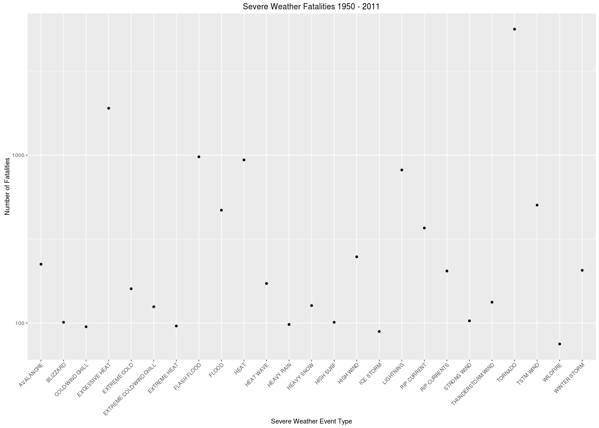
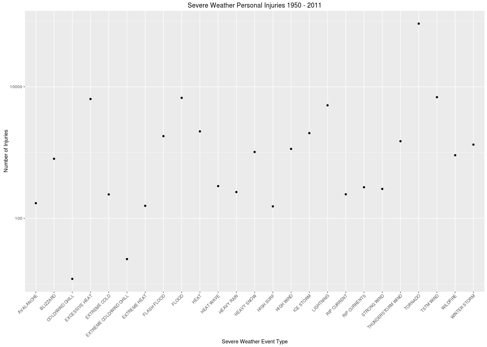
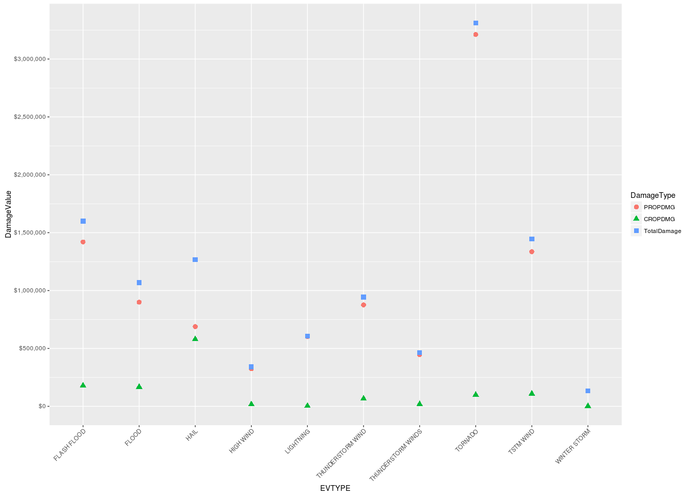

# US Severe Weather Health and Economic Consequences
Leila Tite  
March 15, 2016  
# Synopsis
Immediately after the title, there should be a synopsis which describes and summarizes your analysis in at most 10 complete sentences.


## Basic settings

```r
knitr::opts_chunk$set(fig.width=14, fig.height=10, fig.path='graphs/', base.url='reports/',
                      
                      echo=TRUE, warning=FALSE, message=FALSE)
```

# Data Processing 
which describes (in words and code) how the data were loaded into R and processed for analysis. In particular, the analysis must start from the raw CSV file containing the data. Cannot do any preprocessing outside the document. If preprocessing is time-consuming you may consider using the cache = TRUE option for certain code chunks.

ProjectTemplate searches through the data directory for files. If a file has a name like NAME.EXTENSION with a recognized extension such as .csv or .sql, ProjectTemplate will automatically load the data described in that file into memory. Generally, the automatically loaded data set will end up in an R data frame called NAME that will be placed in R’s global environment. If you’re not sure if your data set will be automatically loaded by ProjectTemplate, you can check the full list of currently supported filetypes here.


```r
getwd()
```

```
## [1] "/home/jsb191/Coursera/ReproducibleResearch/RepData_PeerAssessment2/SevereWeatherAssessment"
```

```r
list.files(path = "data", pattern = NULL, all.files = FALSE)
```

```
## [1] "repdata-data-StormData.csv.bz2"      
## [2] "repdata-peer2_doc-pd01016005curr.pdf"
```

```r
library('ProjectTemplate')
	load.project()
	tables()
```

```
##      NAME                      NROW NCOL  MB
## [1,] repdata.data.StormData 902,297   37 410
##      COLS                                                                            
## [1,] STATE__,BGN_DATE,BGN_TIME,TIME_ZONE,COUNTY,COUNTYNAME,STATE,EVTYPE,BGN_RANGE,BGN
##      KEY
## [1,]    
## Total: 410MB
```

```r
	str(repdata.data.StormData)
```

```
## Classes 'data.table' and 'data.frame':	902297 obs. of  37 variables:
##  $ STATE__   : num  1 1 1 1 1 1 1 1 1 1 ...
##  $ BGN_DATE  : Factor w/ 16335 levels "10/10/1954 0:00:00",..: 6523 6523 4213 11116 1426 1426 1462 2873 3980 3980 ...
##  $ BGN_TIME  : Factor w/ 3608 levels "000","0000","00:00:00 AM",..: 212 257 2645 1563 2524 3126 122 1563 3126 3126 ...
##  $ TIME_ZONE : Factor w/ 22 levels "ADT","AKS","AST",..: 7 7 7 7 7 7 7 7 7 7 ...
##  $ COUNTY    : num  97 3 57 89 43 77 9 123 125 57 ...
##  $ COUNTYNAME: Factor w/ 29601 levels "","5NM E OF MACKINAC BRIDGE TO PRESQUE ISLE LT MI",..: 13513 1873 4598 10592 4372 10094 1973 23873 24418 4598 ...
##  $ STATE     : Factor w/ 72 levels "AK","AL","AM",..: 2 2 2 2 2 2 2 2 2 2 ...
##  $ EVTYPE    : Factor w/ 985 levels "?","ABNORMALLY DRY",..: 830 830 830 830 830 830 830 830 830 830 ...
##  $ BGN_RANGE : num  0 0 0 0 0 0 0 0 0 0 ...
##  $ BGN_AZI   : Factor w/ 35 levels "","E","Eas","EE",..: 1 1 1 1 1 1 1 1 1 1 ...
##  $ BGN_LOCATI: Factor w/ 54429 levels "","?","(01R)AFB GNRY RNG AL",..: 1 1 1 1 1 1 1 1 1 1 ...
##  $ END_DATE  : Factor w/ 6663 levels "","10/10/1993 0:00:00",..: 1 1 1 1 1 1 1 1 1 1 ...
##  $ END_TIME  : Factor w/ 3647 levels "","?","0000",..: 1 1 1 1 1 1 1 1 1 1 ...
##  $ COUNTY_END: num  0 0 0 0 0 0 0 0 0 0 ...
##  $ COUNTYENDN: logi  NA NA NA NA NA NA ...
##  $ END_RANGE : num  0 0 0 0 0 0 0 0 0 0 ...
##  $ END_AZI   : Factor w/ 24 levels "","E","ENE","ESE",..: 1 1 1 1 1 1 1 1 1 1 ...
##  $ END_LOCATI: Factor w/ 34506 levels "","(0E4)PAYSON ARPT",..: 1 1 1 1 1 1 1 1 1 1 ...
##  $ LENGTH    : num  14 2 0.1 0 0 1.5 1.5 0 3.3 2.3 ...
##  $ WIDTH     : num  100 150 123 100 150 177 33 33 100 100 ...
##  $ F         : int  3 2 2 2 2 2 2 1 3 3 ...
##  $ MAG       : num  0 0 0 0 0 0 0 0 0 0 ...
##  $ FATALITIES: num  0 0 0 0 0 0 0 0 1 0 ...
##  $ INJURIES  : num  15 0 2 2 2 6 1 0 14 0 ...
##  $ PROPDMG   : num  25 2.5 25 2.5 2.5 2.5 2.5 2.5 25 25 ...
##  $ PROPDMGEXP: Factor w/ 19 levels "","-","?","+",..: 17 17 17 17 17 17 17 17 17 17 ...
##  $ CROPDMG   : num  0 0 0 0 0 0 0 0 0 0 ...
##  $ CROPDMGEXP: Factor w/ 9 levels "","?","0","2",..: 1 1 1 1 1 1 1 1 1 1 ...
##  $ WFO       : Factor w/ 542 levels "","2","43","9V9",..: 1 1 1 1 1 1 1 1 1 1 ...
##  $ STATEOFFIC: Factor w/ 250 levels "","ALABAMA, Central",..: 1 1 1 1 1 1 1 1 1 1 ...
##  $ ZONENAMES : Factor w/ 25112 levels "","                                                                                                                               "| __truncated__,..: 1 1 1 1 1 1 1 1 1 1 ...
##  $ LATITUDE  : num  3040 3042 3340 3458 3412 ...
##  $ LONGITUDE : num  8812 8755 8742 8626 8642 ...
##  $ LATITUDE_E: num  3051 0 0 0 0 ...
##  $ LONGITUDE_: num  8806 0 0 0 0 ...
##  $ REMARKS   : Factor w/ 436781 levels ""," ","  ","   ",..: 1 1 1 1 1 1 1 1 1 1 ...
##  $ REFNUM    : num  1 2 3 4 5 6 7 8 9 10 ...
##  - attr(*, ".internal.selfref")=<externalptr>
```
# Results 
in which results are presented.


```r
stormy <- (repdata.data.StormData)
stormy$BGN_DATE<-as.Date(as.character(stormy$BGN_DATE),"%m/%d/%Y")
stormyYears <- stormy %>% group_by (year=(as.POSIXlt(BGN_DATE)$year+1900))
startingYear <- stormyYears$year[1]
endingYear <- stormyYears$year[nrow(stormyYears)]
reportRange <- paste(startingYear[1], endingYear, sep=" - ")
fatalityRptTitle <- paste("Severe Weather Fatalities", reportRange,sep=" ")
injuryRptTitle <- paste("Severe Weather Personal Injuries", reportRange,sep=" ")

stormyHealthImpact <- stormy[,lapply(.SD,sum,na.rm=TRUE),by=EVTYPE,.SDcols=c("FATALITIES","INJURIES") ]
stormyHealthImpactFS <- stormyHealthImpact[order(-FATALITIES)]

fp <- qplot(EVTYPE, FATALITIES, data= stormyHealthImpactFS[1:25], log="y", main=fatalityRptTitle, xlab="Severe Weather Event Type", ylab="Number of Fatalities") 
fp +  theme(axis.text.x = element_text(angle = 45, vjust = 1, hjust=1))
```

<!-- -->

```r
stormyHealthImpactIS <- stormyHealthImpact[order(-INJURIES)]

ip <- qplot(EVTYPE, INJURIES, data= stormyHealthImpactFS[1:25], log="y", main=injuryRptTitle, xlab="Severe Weather Event Type", ylab="Number of Injuries") 
ip +  theme(axis.text.x = element_text(angle = 45, vjust = 1, hjust=1))
```

<!-- -->


```r
stormyEconImpact <- stormy[, lapply(.SD, sum, na.rm=TRUE), by=EVTYPE, .SDcols=c("PROPDMG", "CROPDMG") ]
stormyEconImpact <- transform(stormyEconImpact, TotalDamage = PROPDMG + CROPDMG)
stormyEconImpactS <- stormyEconImpact[order(-TotalDamage)]
stormyEconL <- melt(stormyEconImpactS[1:10], id.vars = c("EVTYPE"), variable.name = "DamageType", value.name = "DamageValue")
ep <- ggplot(data=stormyEconL, aes(x=EVTYPE,y=DamageValue), log="y") +
  geom_point(aes(colour=DamageType, shape=DamageType, group=DamageType), size=3) +
  scale_y_continuous(breaks = scales::pretty_breaks(n = 10), labels = scales::dollar) +
  theme(axis.text.x = element_text(angle = 45, vjust = 1, hjust=1))  
ep
```

<!-- -->

Structure of repdata.data.StormData:


```r
str(repdata.data.StormData)
```

```
## Classes 'data.table' and 'data.frame':	902297 obs. of  37 variables:
##  $ STATE__   : num  1 1 1 1 1 1 1 1 1 1 ...
##  $ BGN_DATE  : Factor w/ 16335 levels "10/10/1954 0:00:00",..: 6523 6523 4213 11116 1426 1426 1462 2873 3980 3980 ...
##  $ BGN_TIME  : Factor w/ 3608 levels "000","0000","00:00:00 AM",..: 212 257 2645 1563 2524 3126 122 1563 3126 3126 ...
##  $ TIME_ZONE : Factor w/ 22 levels "ADT","AKS","AST",..: 7 7 7 7 7 7 7 7 7 7 ...
##  $ COUNTY    : num  97 3 57 89 43 77 9 123 125 57 ...
##  $ COUNTYNAME: Factor w/ 29601 levels "","5NM E OF MACKINAC BRIDGE TO PRESQUE ISLE LT MI",..: 13513 1873 4598 10592 4372 10094 1973 23873 24418 4598 ...
##  $ STATE     : Factor w/ 72 levels "AK","AL","AM",..: 2 2 2 2 2 2 2 2 2 2 ...
##  $ EVTYPE    : Factor w/ 985 levels "?","ABNORMALLY DRY",..: 830 830 830 830 830 830 830 830 830 830 ...
##  $ BGN_RANGE : num  0 0 0 0 0 0 0 0 0 0 ...
##  $ BGN_AZI   : Factor w/ 35 levels "","E","Eas","EE",..: 1 1 1 1 1 1 1 1 1 1 ...
##  $ BGN_LOCATI: Factor w/ 54429 levels "","?","(01R)AFB GNRY RNG AL",..: 1 1 1 1 1 1 1 1 1 1 ...
##  $ END_DATE  : Factor w/ 6663 levels "","10/10/1993 0:00:00",..: 1 1 1 1 1 1 1 1 1 1 ...
##  $ END_TIME  : Factor w/ 3647 levels "","?","0000",..: 1 1 1 1 1 1 1 1 1 1 ...
##  $ COUNTY_END: num  0 0 0 0 0 0 0 0 0 0 ...
##  $ COUNTYENDN: logi  NA NA NA NA NA NA ...
##  $ END_RANGE : num  0 0 0 0 0 0 0 0 0 0 ...
##  $ END_AZI   : Factor w/ 24 levels "","E","ENE","ESE",..: 1 1 1 1 1 1 1 1 1 1 ...
##  $ END_LOCATI: Factor w/ 34506 levels "","(0E4)PAYSON ARPT",..: 1 1 1 1 1 1 1 1 1 1 ...
##  $ LENGTH    : num  14 2 0.1 0 0 1.5 1.5 0 3.3 2.3 ...
##  $ WIDTH     : num  100 150 123 100 150 177 33 33 100 100 ...
##  $ F         : int  3 2 2 2 2 2 2 1 3 3 ...
##  $ MAG       : num  0 0 0 0 0 0 0 0 0 0 ...
##  $ FATALITIES: num  0 0 0 0 0 0 0 0 1 0 ...
##  $ INJURIES  : num  15 0 2 2 2 6 1 0 14 0 ...
##  $ PROPDMG   : num  25 2.5 25 2.5 2.5 2.5 2.5 2.5 25 25 ...
##  $ PROPDMGEXP: Factor w/ 19 levels "","-","?","+",..: 17 17 17 17 17 17 17 17 17 17 ...
##  $ CROPDMG   : num  0 0 0 0 0 0 0 0 0 0 ...
##  $ CROPDMGEXP: Factor w/ 9 levels "","?","0","2",..: 1 1 1 1 1 1 1 1 1 1 ...
##  $ WFO       : Factor w/ 542 levels "","2","43","9V9",..: 1 1 1 1 1 1 1 1 1 1 ...
##  $ STATEOFFIC: Factor w/ 250 levels "","ALABAMA, Central",..: 1 1 1 1 1 1 1 1 1 1 ...
##  $ ZONENAMES : Factor w/ 25112 levels "","                                                                                                                               "| __truncated__,..: 1 1 1 1 1 1 1 1 1 1 ...
##  $ LATITUDE  : num  3040 3042 3340 3458 3412 ...
##  $ LONGITUDE : num  8812 8755 8742 8626 8642 ...
##  $ LATITUDE_E: num  3051 0 0 0 0 ...
##  $ LONGITUDE_: num  8806 0 0 0 0 ...
##  $ REMARKS   : Factor w/ 436781 levels ""," ","  ","   ",..: 1 1 1 1 1 1 1 1 1 1 ...
##  $ REFNUM    : num  1 2 3 4 5 6 7 8 9 10 ...
##  - attr(*, ".internal.selfref")=<externalptr>
```

